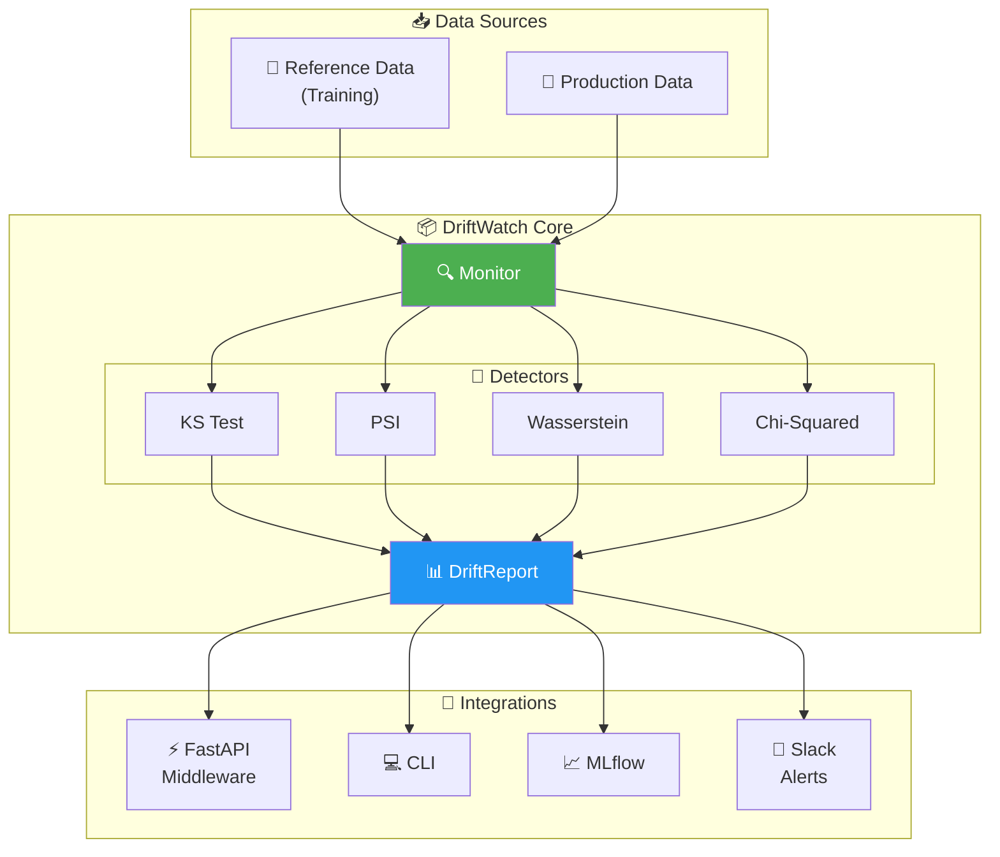
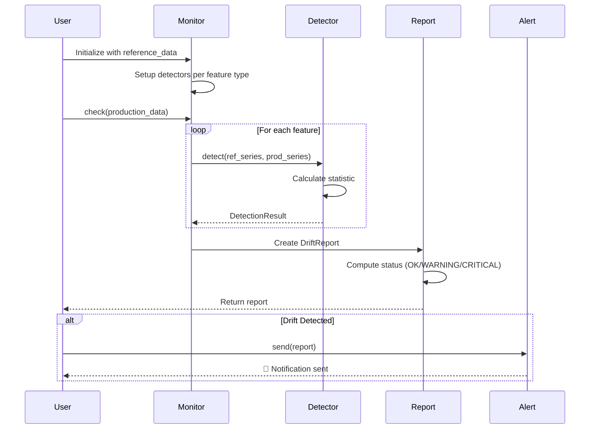
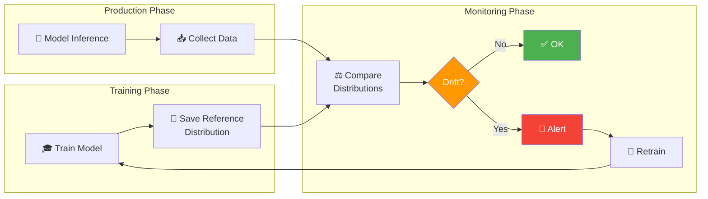
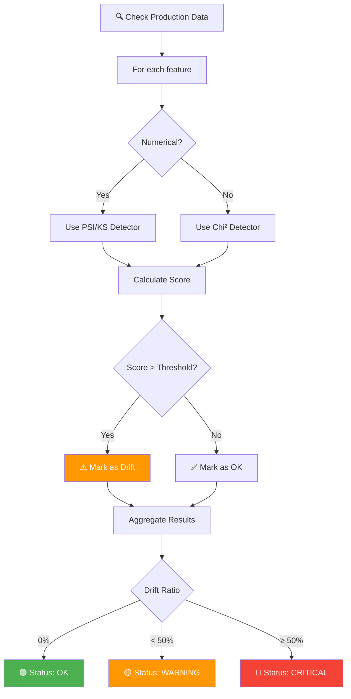

# 🔍 DriftWatch

[](https://www.python.org/downloads/)
[](https://opensource.org/licenses/MIT)
[](https://github.com/psf/black)
[](https://github.com/astral-sh/ruff)

> **Lightweight ML drift monitoring, built for real-world pipelines.**

DriftWatch is an open-source Python library for detecting **data drift** and **model drift** in machine learning systems. It's designed to integrate seamlessly with your existing ML infrastructure without requiring heavy dependencies or vendor lock-in.

---

## ✨ Features

- 📊 **Data Drift Detection** — KS Test, PSI, Wasserstein, Chi-Squared
- 🤖 **Model Drift Detection** — Prediction distribution, performance degradation
- 🔌 **Easy Integration** — FastAPI middleware, MLflow, Slack alerts
- 💻 **CLI Tool** — Batch processing and CI/CD integration
- 📈 **Actionable Reports** — Clear, structured drift reports
- 🧪 **Drift Simulation** — Built-in tools for testing

---

## 🏗️ Architecture



---

## 🔄 Drift Detection Workflow



---

## 📊 How Drift Detection Works



---

## 🧠 Decision Logic



---

## 🚀 Quick Start

### Installation

```bash
pip install driftwatch
```

### Basic Usage

```python
from driftwatch import Monitor

# Initialize with reference data
monitor = Monitor(
    reference_data=train_df,
    features=["age", "income", "category"],
    thresholds={"psi": 0.2, "ks_pvalue": 0.05}
)

# Check for drift
report = monitor.check(production_df)

# View results
print(report.summary())
print(f"Drift detected: {report.has_drift()}")
```

### CLI Usage

```bash
# Check drift between datasets
driftwatch check --ref train.parquet --prod prod.parquet

# Generate JSON report
driftwatch report --format json --output drift_report.json
```

### FastAPI Integration

```python
from fastapi import FastAPI
from driftwatch.integrations import DriftMiddleware

app = FastAPI()
app.add_middleware(DriftMiddleware, monitor=monitor)
```

---

## 📖 Documentation

- [Getting Started](docs/getting-started.md)
- [API Reference](docs/api-reference.md)
- [CLI Guide](docs/cli-guide.md)
- [Integrations](docs/integrations.md)
- [Examples](examples/)

---

## 🧪 Supported Drift Tests

### Numerical Features

| Method | Description | Use Case |
|--------|-------------|----------|
| **KS Test** | Kolmogorov-Smirnov test | General distribution comparison |
| **PSI** | Population Stability Index | Production monitoring |
| **Wasserstein** | Earth Mover's Distance | Sensitive drift detection |

### Categorical Features

| Method | Description | Use Case |
|--------|-------------|----------|
| **Chi-Squared** | Chi-squared test | Category distribution |
| **Frequency PSI** | PSI on category frequencies | Production monitoring |

---

## 🤝 Contributing

We welcome contributions! Please see [CONTRIBUTING.md](CONTRIBUTING.md) for guidelines.

```bash
# Clone the repo
git clone https://github.com/YOUR_USERNAME/driftwatch.git
cd driftwatch

# Install dev dependencies
pip install -e ".[dev]"

# Run tests
pytest

# Run linting
ruff check .
mypy src/
```

---

## 📊 Roadmap

See [ROADMAP.md](ROADMAP.md) for the full development plan.

**V1 (Current Focus)**
- ✅ Core drift detection
- ✅ Python API
- ✅ CLI tool
- ✅ FastAPI middleware
- ✅ Slack alerts

**V2 (Planned)**
- 📊 Dashboard
- 📈 Prometheus metrics
- 🌊 Streaming support

---

## 📜 License

MIT License — see [LICENSE](LICENSE) for details.

---

## 🙏 Acknowledgments

Built with ❤️ for the MLOps community.

Inspired by [Evidently](https://github.com/evidentlyai/evidently), [Great Expectations](https://github.com/great-expectations/great_expectations), and [WhyLabs](https://whylabs.ai/).
