# 🏗️ DriftWatch Architecture

This document provides visual diagrams explaining DriftWatch's architecture, workflow, and decision logic.

---

## Overview

```mermaid
graph TB
    subgraph "📦 DriftWatch Core"
        Monitor["🔍 Monitor"]
        Report["📊 DriftReport"]
        
        subgraph "🧪 Detectors"
            KS["KS Test"]
            PSI["PSI"]
            Wasserstein["Wasserstein"]
            Chi2["Chi-Squared"]
        end
    end
    
    subgraph "📥 Data Sources"
        RefData["📁 Reference Data<br/>(Training)"]
        ProdData["📁 Production Data"]
    end
    
    subgraph "🔌 Integrations"
        FastAPI["⚡ FastAPI<br/>Middleware"]
        CLI["💻 CLI"]
        MLflow["📈 MLflow"]
        Slack["💬 Slack<br/>Alerts"]
    end
    
    RefData --> Monitor
    ProdData --> Monitor
    Monitor --> KS & PSI & Wasserstein & Chi2
    KS & PSI & Wasserstein & Chi2 --> Report
    Report --> FastAPI & CLI & MLflow & Slack
    
    style Monitor fill:#4CAF50,color:#fff
    style Report fill:#2196F3,color:#fff
```

---

## Drift Detection Workflow

---

## How Drift Detection Works

```mermaid
flowchart LR
    subgraph "Training Phase"
        Train["🎓 Train Model"]
        Save["💾 Save Reference<br/>Distribution"]
    end
    
    subgraph "Production Phase"
        Infer["🔮 Model Inference"]
        Collect["📥 Collect Data"]
    end
    
    subgraph "Monitoring Phase"
        Compare["⚖️ Compare<br/>Distributions"]
        Decision{Drift?}
        OK["✅ OK"]
        Alert["🚨 Alert"]
        Retrain["🔄 Retrain"]
    end
    
    Train --> Save
    Save --> Compare
    Infer --> Collect --> Compare
    Compare --> Decision
    Decision -->|No| OK
    Decision -->|Yes| Alert --> Retrain
    Retrain --> Train
    
    style Decision fill:#FF9800,color:#fff
    style Alert fill:#f44336,color:#fff
    style OK fill:#4CAF50,color:#fff
```

---

## Decision Logic

---

## Component Structure

---

## CI/CD Pipeline

```mermaid
flowchart TD
    subgraph "GitHub Actions"
        Push["📤 Push / PR"]
        
        subgraph "Lint Job"
            Ruff["Ruff Check"]
            Mypy["Mypy"]
            Format["Format Check"]
        end
        
        subgraph "Test Job"
            Test39["Python 3.9"]
            Test310["Python 3.10"]
            Test311["Python 3.11"]
            Test312["Python 3.12"]
        end
        
        subgraph "Build Job"
            Build["Build Package"]
            Check["Twine Check"]
            Artifact["Upload Artifact"]
        end
    end
    
    Push --> Ruff & Mypy & Format
    Ruff & Mypy & Format --> Test39 & Test310 & Test311 & Test312
    Test39 & Test310 & Test311 & Test312 --> Build
    Build --> Check --> Artifact
    
    style Push fill:#4CAF50,color:#fff
    style Artifact fill:#2196F3,color:#fff
```

---

## Git Workflow

---

## Learn More

- [Getting Started](getting-started.md)
- [API Reference](api-reference.md)
- [Contributing](../CONTRIBUTING.md)
