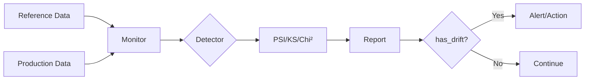

# Core Concepts

Understand the fundamentals of drift detection with DriftWatch.

## What is Drift?

**Drift** occurs when the statistical properties of your production data diverge from your training data.

### Types of Drift

#### 1. Feature Drift (Covariate Shift)

Input features change distribution:

```
Training:  age ~ N(35, 10)
Production: age ~ N(45, 12)  ← Distribution shifted!
```

#### 2. Label Drift

Target variable distribution changes (not detected by DriftWatch).

#### 3. Concept Drift

The relationship between features and target changes.

---

## How DriftWatch Works



### 1. Reference Phase

Store training data statistics:

```python
monitor = Monitor(reference_data=train_df)
```

### 2. Detection Phase

Compare production data:

```python
report = monitor.check(prod_df)
```

### 3. Action Phase

Respond to drift:

```python
if report.has_drift():
    # Retrain, alert, investigate, etc.
    alerter.send(report)
```

---

## Drift Metrics

### PSI (Population Stability Index)

measures bin-wise distribution divergence.

**Formula:**
```
PSI = Σ (p_prod - p_ref) × ln(p_prod / p_ref)
```

**Interpretation:**

- PSI < 0.1: No drift
- 0.1 ≤ PSI < 0.2: Moderate drift
- PSI ≥ 0.2: Significant drift

### KS Test (Kolmogorov-Smirnov)

Statistical hypothesis test comparing CDFs.

**Null Hypothesis:** Distributions are identical

**p-value < threshold** → Reject null → Drift detected

### Wasserstein Distance

"Earth Mover's Distance" - minimum work to transform distributions.

More sensitive to subtle changes than PSI.

---

## When to Check for Drift

### Batch Monitoring

Check periodically (daily/weekly):

```python
# daily_check.py
import schedule

def check_drift():
    prod_df = load_latest_production_data()
    report = monitor.check(prod_df)
    if report.has_drift():
        send_alert(report)

schedule.every().day.at("00:00").do(check_drift)
```

### Real-Time Monitoring

Check continuously with FastAPI middleware:

```python
app.add_middleware(
    DriftMiddleware,
    monitor=monitor,
    check_interval=100  # Every 100 requests
)
```

### Event-Based

Check before/after key events:

```python
# Before deployment
report = monitor.check(validation_data)
if report.has_drift():
    raise Exception("Cannot deploy: drift detected in validation set")

# After data refresh
new_data = load_new_batch()
report = monitor.check(new_data)
```

---

## Responding to Drift

### 1. Investigate

Analyze which features drifted and why:

```python
for result in report.feature_results:
    if result.has_drift:
        print(f"{result.feature_name}: score={result.score}")
        # Plot distributions, investigate data sources
```

### 2. Retrain

If drift is significant:

```python
if report.drift_ratio() > 0.5:
    trigger_retraining_pipeline()
```

### 3. Alert Stakeholders

```python
if report.status == DriftStatus.CRITICAL:
    alerter.send(report)
    notify_data_team()
```

### 4. Update Reference

After retraining:

```python
new_train_df = load_retrain_data()
monitor.update_reference(new_train_df)
```

---

## Next Steps

- [Drift Detectors →](../user-guide/detectors.md)
- [Thresholds →](../user-guide/thresholds.md)
- [Monitoring Guide →](../user-guide/monitoring.md)
